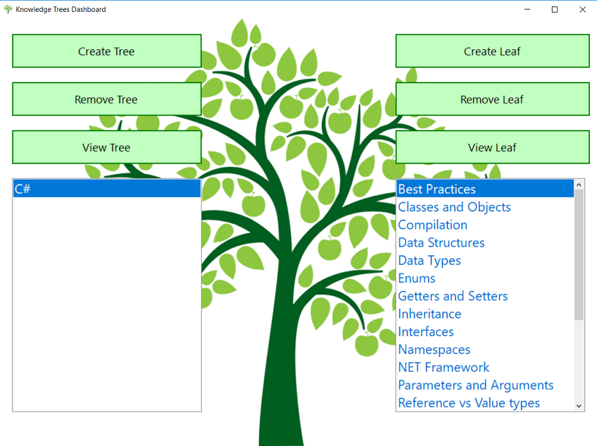

# Knowledge-Trees

I try to write most of the things I learn down. I used to do this by creating an empty folder in my desktop, and populating it with word documents. Each word document would be related to a broad topic, such as C#, and within that word document I would separate the things I wrote about through formatting.

This works well, but it can get unnecessarily burdensome to continually format & search through the documents.

To that extent, I wanted to create a simple Windows desktop application that would help me better better organize my entries. The goal of this application is to just help the user quickly create and navigate through his folders (the Knowledge Trees, each representing a distinct subject) and within those folders all of the user's entries (Leaves).

The current end result would look like this:

(TODO) Here is the link to download the application: 

